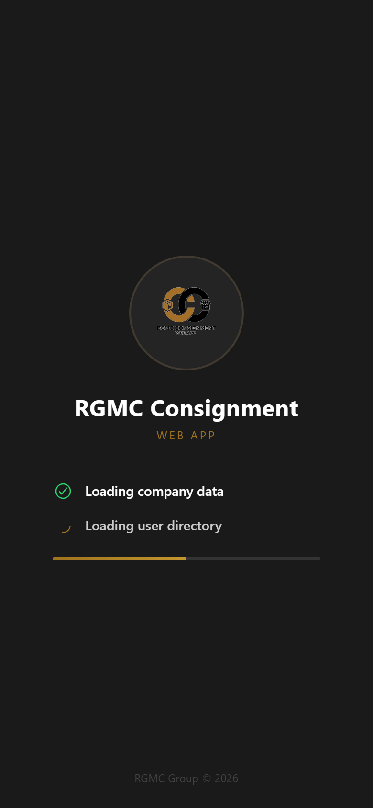
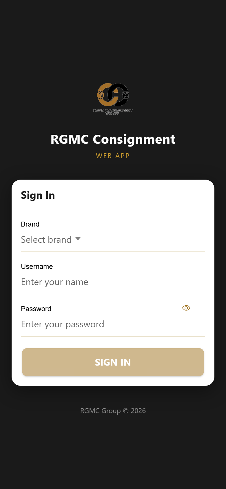
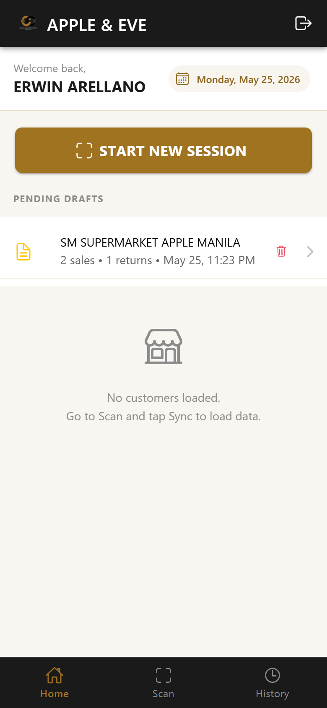
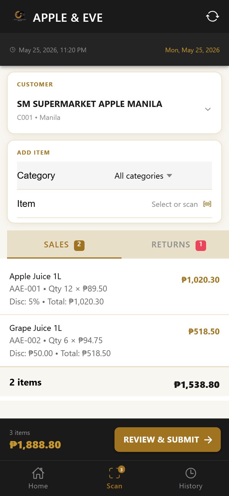
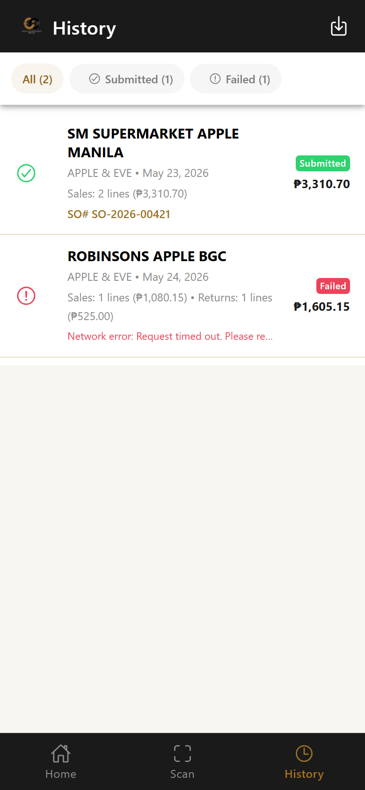
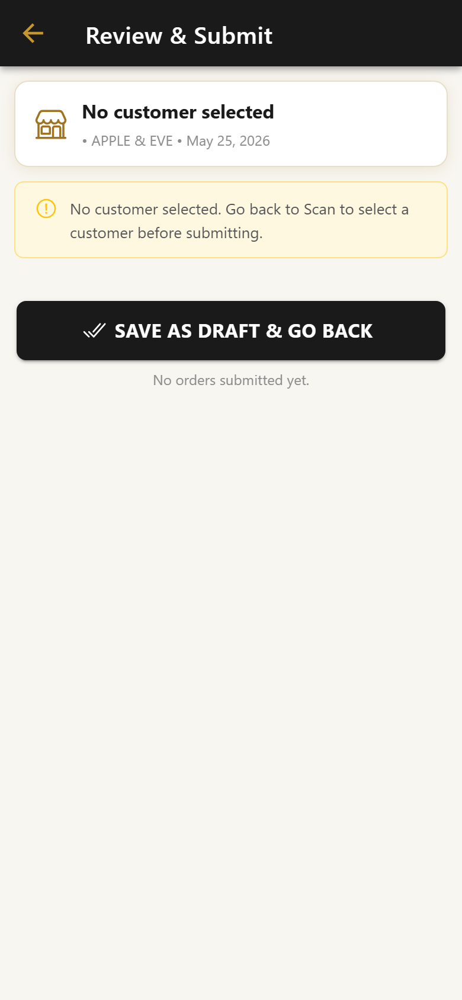
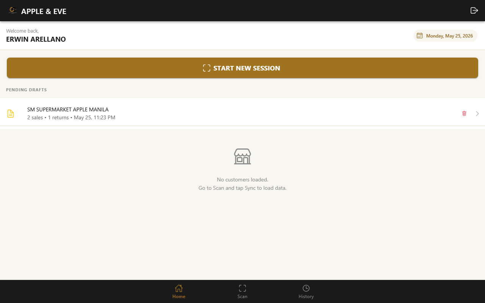
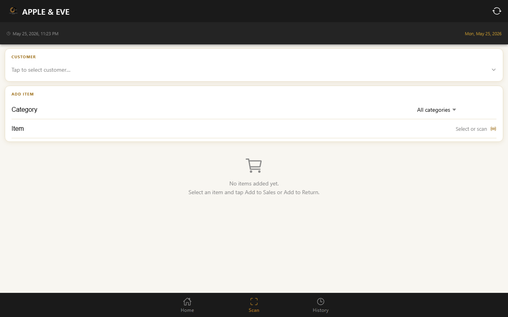
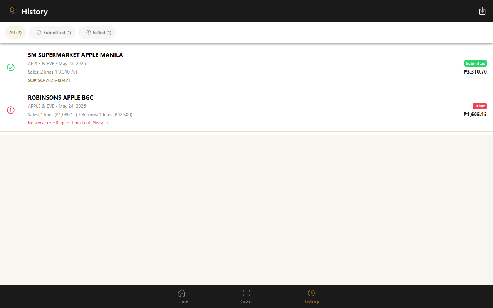

<div align="center">
  
  <h1><span style="color:#a07320">RGMC Consignment Web App</span></h1>
  <p style="color:#666">Mobile-first scanning app for field sales reps to log consignment sales and returns against a live Business Central API.</p>

  [](https://vuejs.org/)
  [](https://ionicframework.com/)
  [](https://www.typescriptlang.org/)
  [](https://vitejs.dev/)
  [](https://pinia.vuejs.org/)
  [](https://cloud.google.com/run)
</div>

---

## 📋 Table of Contents

- [Overview](#-overview)
- [Screenshots](#-screenshots)
- [Tech Stack](#-tech-stack)
- [Features](#-features)
- [Screens & Routes](#-screens--routes)
- [Project Structure](#-project-structure)
- [Setup & Installation](#-setup--installation)
- [Environment Variables](#-environment-variables)
- [Running the App](#-running-the-app)
- [Building for Production](#-building-for-production)
- [Deploying to Cloud Run](#-deploying-to-cloud-run)
- [Mobile Deployment](#-mobile-deployment)
- [API Endpoints](#-api-endpoints)
- [Data & Caching Strategy](#-data--caching-strategy)
- [Authentication Flow](#-authentication-flow)
- [Session Lifecycle](#-session-lifecycle)
- [Offline Mode](#-offline-mode)
- [Brand & Design Tokens](#-brand--design-tokens)
- [License](#-license)

---

## 🗺 Overview

RGMC Consignment is a **mobile-first progressive web app** used by RGMC field sales representatives to record consignment transactions on-site at customer locations.

Sales reps select a customer, scan or search items from the product catalog, set quantities and discounts, then submit structured **Sales Orders** and **Sales Return Orders** directly to the Microsoft Business Central (BC) backend.

**Key design decisions:**

- **Offline-first scanning** — Items and customers are cached in memory / localStorage so the scan flow works without an active internet connection. Submission requires connectivity; orders wait in local draft state until the rep is back online.
- **No localStorage for items** — The full BC items catalog exceeds the browser's 5 MB per-origin cap. Items are stored in a module-level JS variable (`_itemsMemory`) so they persist across tab navigation but never cause `QuotaExceededError`.
- **nginx proxy eliminates CORS** — In production the container's nginx proxies all `/bc/*` requests to the GCP API server-side, so the browser never makes cross-origin requests.
- **Single-container deploy** — Vite builds a static bundle; nginx serves it and reverse-proxies API calls in the same container deployed to Cloud Run.

---

## 📸 Screenshots

### <span style="color:#2a9d8f">📱 Mobile</span>

<table>
  <tr>
    <td align="center"><br/><sub>Splash — loading brands &amp; contacts</sub></td>
    <td align="center"><br/><sub>Login — brand select + credentials</sub></td>
    <td align="center"><br/><sub>Home — pending drafts + start session</sub></td>
  </tr>
  <tr>
    <td align="center"><br/><sub>Scan — customer + item picker (empty)</sub></td>
    <td align="center"><br/><sub>Scan — items added, sales &amp; returns tabs</sub></td>
    <td align="center"><br/><sub>History — submitted + failed sessions</sub></td>
  </tr>
  <tr>
    <td align="center"><br/><sub>Submit — review &amp; submit orders</sub></td>
    <td></td>
    <td></td>
  </tr>
</table>

### <span style="color:#2a9d8f">🖥️ Desktop / Tablet</span>

<table>
  <tr>
    <td align="center"><br/><sub>Home — desktop layout</sub></td>
    <td align="center"><br/><sub>Scan — desktop layout</sub></td>
  </tr>
  <tr>
    <td align="center" colspan="2"><br/><sub>History — desktop layout</sub></td>
  </tr>
</table>

---

## 🛠 Tech Stack

| Layer | Technology | Version |
|---|---|---|
| UI Framework | Ionic Vue | 8.3.0 |
| JS Framework | Vue 3 (Composition API) | 3.4.21 |
| Language | TypeScript | 5.4.5 |
| State Management | Pinia | 2.1.7 |
| Routing | Ionic Vue Router / Vue Router | 8.3.0 / 4.3.3 |
| HTTP Client | Axios | 1.7.2 |
| Icons | Ionicons | 7.4.0 |
| Build Tool | Vite | 5.2.8 |
| Type Checker | vue-tsc | 2.0.11 |
| Mobile Runtime | Capacitor (CLI + Core) | 6.1.0 |
| Web Server (prod) | nginx stable-alpine | — |
| Container Runtime | Google Cloud Run | asia-southeast1 |
| Node (build stage) | Node.js Alpine | 20 |

---

## ✨ Features

### <span style="color:#2a9d8f">🔐 Authentication</span>

- Brand selection from a dropdown populated at splash time
- Credential matching against Business Central contacts — username (display name) + bcrypt-verified password
- **First-login password setup** — contacts without a stored `passwordHash` are prompted via `SetPasswordModal` to create one before signing in; hash is saved locally and synced to BC
- Auth session persisted in `localStorage` and rehydrated on page reload
- Post-login pre-sync: customers, items, and item categories are fetched immediately after auth so ScanningPage is ready with zero manual interaction
- **Cycling button labels** during sync (5-second rotation): "Loading data…" → "Fetching items…" → "Loading customers…" → "Preparing app…" → "Almost ready…"
- Auth guard in `main.ts` — unauthenticated deep links redirect to `/splash`

### <span style="color:#2a9d8f">📷 Scanning & Item Entry</span>

- Manual item search by name or number with category filter
- Barcode scanner integration (via browser camera / Capacitor)
- Quantity stepper (tap +/−)
- Discount picker: toggle between **% Percent** and **₱ Fixed Amount** with live grand total
- Confirm sheet (bottom sheet at 92% height) with all fields visible before committing
- Items added to **Sales Order** or **Return Order** independently within the same session
- Swipe-to-delete on individual order lines
- Customer selector modal with live search across all cached customers

### <span style="color:#2a9d8f">🎉 First-Login Onboarding</span>

- Full-screen `WelcomeModal` shown once after the very first successful login (gated by `rgmc_welcome_seen` in localStorage)
- 5-slide feature tour: Intro → Home Dashboard → Scan & Record → Order History → Review & Submit
- Auto-advances every 5 seconds; timer resets on any manual interaction
- Gold progress bar, pill-shaped dot navigation, prev/next buttons, skip button (hidden on last slide)
- Phone mockup frame displays actual app screenshots for each feature
- "Get Started" CTA on the final slide; Skip on any earlier slide — both mark the tour as seen

### <span style="color:#2a9d8f">👤 Profile & Account</span>

- **Profile menu** (popover, top-right of every screen): user avatar, display name, username, brand; quick access to Sync and Sign Out
- **Profile modal**: read-only contact fields (name, job title, phone, email, company, username, contact no.), in-place password change with live validation, photo upload
- **Profile photo**: tapping the avatar in the Profile modal opens the device file picker; selected image is previewed immediately (base64 data URL) and POSTed to BC via the GCP API; photo is cached in `rgmc_auth_photo` (localStorage) for offline display
- **Password change**: bcrypt-hashes the new password client-side (cost 10), saves hash to the local contacts cache, and PATCHes the BC contact record

### <span style="color:#2a9d8f">🌗 Dark / Light Theme</span>

- Moon / sun toggle in the top-right header on every app screen
- Theme persisted in `rgmc_theme` localStorage key; restored instantly at module load to prevent flash-of-wrong-theme
- Module-level singleton (`useTheme`) — all components share the same reactive `isDark` ref without re-reading localStorage
- Applies via `data-theme="dark"|"light"` attribute on `<html>`, toggling the full CSS variable palette

### <span style="color:#2a9d8f">🔄 Sync & Caching</span>

- One-tap sync fetches customers, items, and item categories in parallel
- **Cycling sync messages** on the loading card (5-second rotation): "Syncing data…" → "Fetching items catalog…" → "Loading product data…" → "Preparing inventory…" → "Almost there…"
- Pull-to-refresh gesture on ScanningPage (triggers full sync), Home (reloads customers + sessions), and History (reloads session store)
- Last-sync timestamp shown in the header sub-bar
- Auto-sync on mount if items are missing from memory (handles tab reload without re-login)

### <span style="color:#2a9d8f">📶 Network Awareness</span>

- **`useNetworkStatus` composable** — tracks `isOnline` (`window online`/`offline` events) and `isSlowConnection` (Network Information API `effectiveType`)
- Amber notice banner on ScanningPage and LoginPage for offline / slow connection
- Slow-sync warning triggered after 10 seconds of active syncing
- **OFFLINE MODE** — amber pill badge replaces the today label in the scan header sync-bar; all scan / item / customer / session operations continue normally with cached data
- SubmitPage blocks order submission when offline; amber "Offline Mode" notice shown; buttons re-enable automatically on reconnect

### <span style="color:#2a9d8f">📤 Submission</span>

- Sales and return orders submitted independently
- Confirmation alert before each submission
- Series numbers from BC displayed in done badges after successful submit
- Failed submissions saved locally for retry; shown in History with error detail
- Session finalised → moved from drafts to History

### <span style="color:#2a9d8f">📜 History & Drafts</span>

- All completed sessions (submitted + failed) listed with filter chips: All / Submitted / Failed
- Tap a session to see full order line detail in a modal
- Failed sessions have a Retry button that restores them as a new draft
- Pending drafts shown on the Home screen with resume / delete actions
- Pull-to-refresh reloads sessions from localStorage
- CSV export of history via the download button

---

## 🖥 Screens & Routes

```
/                  → redirect to /splash
/splash            → SplashPage   — pre-loads brands + contacts; redirects to /login or /app/home
/login             → LoginPage    — brand select, credentials, post-login data sync
/app               → TabsPage     — bottom tab shell (Home / Scan / History)
  /app/home        → LandingPage  — welcome, pending drafts, customer quick-list, pull-to-refresh
  /app/scan        → ScanningPage — customer picker, item search/scan, order line builder, PTR
  /app/history     → HistoryPage  — completed sessions with filter + detail modal, pull-to-refresh
/app/submit        → SubmitPage   — review + submit sales/return orders, finalize session
```

> 💡 `/app/submit` sits **outside** the TabsPage shell intentionally — it has a back button only, no tab bar, to keep the submission flow focused.

---

## 📁 Project Structure

```
rgmc-consignment-webapp/
├── public/
│   └── static/
│       ├── cons-logo.png              # Header logo (32 px)
│       ├── cons-logo-splash.png       # Full splash / welcome logo (220 px)
│       └── screenshots/               # App screenshots used in WelcomeModal tour
├── src/
│   ├── main.ts                        # Bootstrap: Pinia, router, auth guard, store rehydration
│   ├── App.vue                        # Root component
│   ├── env.d.ts                       # Vite env type declarations
│   │
│   ├── router/
│   │   └── index.ts                   # All routes (lazy-loaded), createWebHistory
│   │
│   ├── types/
│   │   └── index.ts                   # Brand, Contact, Customer, Item, ItemCategory,
│   │                                  # OrderLine, ScanSession, payload types
│   │
│   ├── stores/
│   │   ├── auth.store.ts              # brand, user, photoUrl, login(), logout(),
│   │   │                              # completePasswordSetup(), loadFromStorage()
│   │   └── session.store.ts           # currentSession, drafts, completedSessions,
│   │                                  # addSalesOrder/Return(), markSubmitted(), etc.
│   │
│   ├── services/
│   │   ├── api.service.ts             # Axios client — all /bc/* calls, 60s timeout
│   │   └── storage.service.ts         # localStorage + IndexedDB wrappers;
│   │                                  # _itemsMemory (in-memory); hasSeenWelcome()
│   │
│   ├── composables/
│   │   ├── useSync.ts                 # isSyncing, sync(), lastSyncLabel, hasCache
│   │   ├── useNetworkStatus.ts        # isOnline, isSlowConnection
│   │   ├── useTheme.ts                # isDark, toggleTheme(); module-level singleton
│   │   ├── useGoldAccent.ts           # Gold accent CSS helpers
│   │   └── useCustomerFilter.ts       # Reactive customer filter by brand + search
│   │
│   ├── utils/
│   │   └── format.ts                  # formatCurrency (₱), formatDate, formatDiscount
│   │
│   ├── components/
│   │   ├── AppLogo.vue                # Brand logo switcher (cons-logo / logo)
│   │   ├── ItemSelectorModal.vue      # Full-screen item search + category filter modal
│   │   ├── UserAvatar.vue             # Circular avatar: photo or initials fallback
│   │   ├── ProfileMenu.vue            # Header popover: user info, Sync, Sign Out
│   │   ├── ProfileModal.vue           # Full profile sheet: contact details, photo upload,
│   │   │                              # password change
│   │   ├── SetPasswordModal.vue       # First-login forced password setup (can-dismiss:false)
│   │   └── WelcomeModal.vue           # One-time onboarding tour (5 slides, auto-advance)
│   │
│   ├── views/
│   │   ├── SplashPage.vue             # Animated loader; IDB init; pre-fetches brands + contacts
│   │   ├── LoginPage.vue              # Auth form; cycling sync labels; post-login sync
│   │   ├── TabsPage.vue               # Ion-tabs shell with bottom tab bar
│   │   ├── LandingPage.vue            # Home: welcome hero, drafts, customer list, WelcomeModal
│   │   ├── ScanningPage.vue           # Core scan screen; offline badge; cycling messages; PTR
│   │   ├── HistoryPage.vue            # Session history; filters; detail modal; pull-to-refresh
│   │   └── SubmitPage.vue             # Order review; offline guard on submit buttons
│   │
│   └── theme/
│       └── variables.css              # Ionic CSS variable overrides; RGMC gold brand tokens;
│                                      # dark-mode palette under [data-theme="dark"]
│
├── Dockerfile                         # Multi-stage: Node 20 build → nginx:stable-alpine serve
├── nginx.conf                         # Template: ${PORT}, /bc/* proxy_pass, SPA fallback
├── docker-entrypoint.sh               # envsubst '$PORT' → real nginx.conf, exec nginx
├── vite.config.ts                     # @/ alias; dev proxy /bc/* → GCP API on port 8100
├── .env                               # VITE_API_BASE_URL= (dev, empty = Vite proxy)
├── .env.production                    # VITE_API_BASE_URL= (prod, empty = nginx proxy)
└── package.json                       # Scripts: dev, build, preview
```

---

## ⚙️ Setup & Installation

**Prerequisites**

- Node.js 20+
- npm 10+
- Docker Desktop (for production image builds)
- Google Cloud CLI `gcloud` (for Cloud Run deploys)

```bash
# Clone the repository
git clone <repo-url>
cd rgmc-consignment-webapp

# Install dependencies
npm install
```

---

## 🔑 Environment Variables

| Variable | File | Value | Purpose |
|---|---|---|---|
| `VITE_API_BASE_URL` | `.env` | *(empty)* | Dev: empty = Vite proxy rewrites `/bc/*` to GCP API |
| `VITE_API_BASE_URL` | `.env.production` | *(empty)* | Prod: empty = nginx `proxy_pass` handles `/bc/*` |
| `PORT` | Cloud Run runtime | `8080` (default) | nginx listen port, injected by Cloud Run at startup |

> ⚠️ **`VITE_API_BASE_URL` is baked into the JS bundle at build time.** Setting it as a Cloud Run runtime env var has no effect. Override at image build time with `--build-arg VITE_API_BASE_URL=<url>`.

> 📌 `PORT` is substituted by `docker-entrypoint.sh` via `envsubst '$PORT'` (single-quoted to leave nginx's own variables untouched).

---

## 🚀 Running the App

```bash
# Start development server at http://localhost:8100
# Vite dev proxy: /bc/* → https://rgmc-gcp-api-935246372408.asia-southeast1.run.app
npm run dev

# Type-check without emitting (must exit 0 before any deploy)
npx vue-tsc --noEmit

# Preview the production build locally
npm run preview
```

---

## 📦 Building for Production

```bash
# Type-check then Vite build → dist/
npm run build
```

Output lands in `dist/`. The bundle has `VITE_API_BASE_URL` baked as an empty string so axios makes relative `/bc/*` requests that nginx intercepts.

---

## ☁️ Deploying to Cloud Run

```powershell
# Build the Docker image (multi-stage: Node 20 build → nginx:stable-alpine)
docker build -t gcr.io/durable-woods-465907-n1/rgmc-consignment-webapp .

# Push to Google Container Registry
docker push gcr.io/durable-woods-465907-n1/rgmc-consignment-webapp

# Deploy to Cloud Run
gcloud run deploy rgmc-consignment-webapp `
  --image gcr.io/durable-woods-465907-n1/rgmc-consignment-webapp `
  --region asia-southeast1 `
  --platform managed `
  --allow-unauthenticated
```

**Cloud Run service details**

| Setting | Value |
|---|---|
| Project ID | `durable-woods-465907-n1` |
| Service name | `rgmc-consignment-webapp` |
| Region | `asia-southeast1` |
| GCP API upstream | `https://rgmc-gcp-api-935246372408.asia-southeast1.run.app` |

> 💡 Cloud Run injects `$PORT` at container start. `docker-entrypoint.sh` runs `envsubst '$PORT' < /etc/nginx/nginx.conf.template > /etc/nginx/nginx.conf` then `exec nginx -g 'daemon off;'` so nginx is PID 1.

**Post-deploy verification**

1. Open Cloud Run URL → Splash shows brands + contacts with green checkmarks
2. First-time user: enter credentials with no password set → `SetPasswordModal` appears → set password → dismissed to login
3. Log in with password → button cycles through sync labels → navigates to Home
4. First login: `WelcomeModal` tour appears (5 slides, auto-advance, skip button); dismissed on "Get Started"
5. Tap profile avatar → popover shows user name, brand, Sync and Sign Out options
6. Open Profile → tap avatar → upload photo → immediate preview, BC sync in background
7. Toggle moon/sun icon in header → theme switches dark ↔ light; survives page reload
8. Tap "Start New Session" → ScanningPage opens with items already loaded (from IndexedDB on reload)
9. Select/scan an item → Confirm sheet: quantity stepper, discount toggle, gold grand total
10. Navigate to SubmitPage while offline → Submit buttons disabled, amber notice shown
11. Submit online → series numbers in done badges; session appears in History

---

## 📱 Mobile Deployment

Capacitor `@capacitor/cli` and `@capacitor/core` v6.1.0 are installed but **native platforms have not been initialised**. No `android/` or `ios/` directories exist yet.

```bash
# Build the web bundle first
npm run build

# One-time: initialise Capacitor
npx cap init "RGMC Consignment" "ph.rgmc.consignment"

# Add a native platform
npx cap add android
npx cap add ios

# Sync web assets into the native project
npx cap sync

# Open in Android Studio / Xcode
npx cap open android
npx cap open ios
```

---

## 🌐 API Endpoints

All requests use the `/bc/` path prefix. Vite proxies them in dev; nginx proxies them in production — the browser never makes a cross-origin request.

| Method | Path | Description |
|---|---|---|
| `GET` | `/bc/brands` | List all brand records |
| `GET` | `/bc/contacts` | List all contacts (used for auth matching) |
| `GET` | `/bc/customers` | List all customers |
| `GET` | `/bc/items` | List full product/item catalog |
| `GET` | `/bc/item-categories` | List item categories |
| `POST` | `/bc/sales-orders` | Submit a sales order |
| `POST` | `/bc/sales-return-orders` | Submit a sales return order |

**POST `/bc/sales-orders` — request body**

```json
{
  "customerNumber": "C00123",
  "lines": [
    {
      "itemNumber": "ITEM-001",
      "description": "Product description",
      "quantity": 2,
      "unitPrice": 150.00,
      "discountPercent": 10,
      "lineDiscountAmount": 0
    }
  ]
}
```

**POST `/bc/sales-return-orders`** — identical shape to sales orders.

> 📌 Axios timeout is 60 seconds. All 4xx/5xx responses are normalised to `Error` instances via the response interceptor before reaching callers.

---

## 💾 Data & Caching Strategy

### <span style="color:#2a9d8f">localStorage keys</span>

| Key | Type | Contents | When refreshed |
|---|---|---|---|
| `rgmc_auth` | `AuthSession` | `{ brand, user }` — full Brand + Contact | Login / cleared on logout |
| `rgmc_auth_photo` | `string` | Base64 data URL of the user's profile photo | After successful photo upload |
| `rgmc_cache_brands` | `Brand[]` | All brands | SplashPage load |
| `rgmc_cache_contacts` | `Contact[]` | All contacts incl. `username` + `passwordHash` | SplashPage load / password setup |
| `rgmc_cache_customers` | Slim `Customer[]` | `{ id, number, displayName, city }` | Sync |
| `rgmc_cache_item_categories` | `ItemCategory[]` | All item categories | Sync |
| `rgmc_sync_timestamps` | `SyncTimestamps` | ISO strings per entity | After each sync |
| `rgmc_sessions` | `ScanSession[]` | Completed sessions (submitted + failed) | On submit / retry |
| `rgmc_drafts` | `ScanSession[]` | In-progress sessions | Every order-line mutation |
| `rgmc_welcome_seen` | `"1"` | Marks the onboarding tour as completed | After first Welcome modal close |
| `rgmc_theme` | `"dark"` \| `"light"` | User's preferred colour scheme | On theme toggle |

### <span style="color:#2a9d8f">IndexedDB (`rgmc-cache`)</span>

| Store | Key | Contents | Why IndexedDB |
|---|---|---|---|
| `items` | `"all"` | Slim `Item[]` — `{ id, number, displayName, description≤120chars, itemCategoryCode, unitPrice }` | Full BC items catalog exceeds the 5 MB per-origin localStorage quota |

Items are written to IndexedDB on every sync and restored into `_itemsMemory` at startup via `StorageService.init()` (called in `SplashPage.onMounted`). This means items **survive page reload** without a re-login or manual sync.

### <span style="color:#2a9d8f">In-memory only (tab lifetime)</span>

| Variable | Contents | Notes |
|---|---|---|
| `_itemsMemory` in `storage.service.ts` | Same slim `Item[]` as IndexedDB | Module-level ref; populated from IndexedDB on startup, updated on every sync |

> ⚠️ `rgmc_cache_items` is a legacy localStorage key from before the in-memory + IndexedDB migration. `StorageService.clearAll()` explicitly removes it to clean up old tabs.

---

## 🔐 Authentication Flow

```
1. SplashPage mounts
   → StorageService.init() — restores items from IndexedDB into _itemsMemory
   → If authenticated + full local cache → skip network, redirect /app/home immediately
   → Otherwise: GET /bc/brands → rgmc_cache_brands
                GET /bc/contacts → rgmc_cache_contacts (preserves local username/passwordHash)
   → Both done → green checkmarks → redirect /login (or /app/home if already authed)

2. User fills: Brand (dropdown) + Username + Password
   → authStore.login(brand, username, password)
   → Reads cached contacts (no extra network call)
   → Lookup: contact.username.toUpperCase() === username.toUpperCase()
             OR contact.displayName.toUpperCase() === username.toUpperCase()
   → If contact has no passwordHash → forcePasswordSetup = true
        → SetPasswordModal shown over LoginPage (can-dismiss: false)
        → User creates password → bcrypt.hash(pw, 10) → stored in cache + PATCHed to BC
        → Modal dismisses → user signs in with new password

   → If contact has passwordHash → bcrypt.compare(password, hash)
   → Match → authStore.brand + authStore.user set
           → authStore.photoUrl loaded from rgmc_auth_photo (if cached)
           → AuthSession written to rgmc_auth (localStorage)

3. Post-login pre-sync (LoginPage.handleLogin)
   → isSyncing = true, button label cycles every 5s
   → Promise.all([getCustomers(), getItems(), getItemCategories()])
   → customers  → rgmc_cache_customers (localStorage, slim fields)
   → items      → _itemsMemory + IndexedDB rgmc-cache/items store
   → categories → rgmc_cache_item_categories (localStorage)
   → isSyncing = false → router.replace('/app/home')

4. First-time user → WelcomeModal shown on LandingPage
   → !StorageService.hasSeenWelcome() → showWelcome = true
   → 5-slide auto-advancing tour
   → On Skip / Get Started → StorageService.markWelcomeSeen() → modal dismissed

5. On page reload / tab refresh
   → router.beforeEach: isAuthenticated is false → redirect /splash
   → SplashPage: StorageService.init() restores items from IndexedDB
   → If authenticated + full local cache → redirect /app/home immediately (no network)
   → authStore.loadFromStorage() rehydrates brand + user + photoUrl
   → ScanningPage onMounted: cachedItems.length === 0 → auto-calls handleSync()
```

> 📌 The auth guard fires before `loadFromStorage()` by design — direct deep-link navigation always bounces through `/splash`, preventing a race condition where the guard runs before auth state is in memory.

---

## 🔄 Session Lifecycle

```
startNewSession(brand, user)
    │
    ▼
ScanningPage
    ├── selectCustomer()    → sessionStore.setCustomer()  → _saveDraft()
    ├── addSalesOrder()     → sessionStore.addSalesOrder() → _saveDraft()
    └── addReturnOrder()    → sessionStore.addReturnOrder() → _saveDraft()
         │
         │  (every mutation auto-saves to rgmc_drafts localStorage)
         ▼
SubmitPage — review all lines
    │
    ├── [ONLINE]  confirmSubmit('sales')
    │                POST /bc/sales-orders
    │                markSubmitted(salesSeries)
    │                → session moved: rgmc_drafts → rgmc_sessions
    │
    ├── [ONLINE]  confirmSubmit('returns')
    │                POST /bc/sales-return-orders
    │                markSubmitted(returnSeries)
    │
    ├── [OFFLINE] Submit buttons DISABLED
    │             Amber "Offline Mode" notice shown
    │             Draft persists in rgmc_drafts
    │
    └── finalizeSession()
          submitted → router /app/home, currentSession = null
          failed    → stays in rgmc_sessions { status: 'failed' }

History — retryFailedSession(session)
    → remove from rgmc_sessions
    → restore as draft in rgmc_drafts
    → resume in ScanningPage
```

---

## 📶 Offline Mode

RGMC Consignment keeps the core scan flow running during connectivity loss.

| Scenario | Behaviour |
|---|---|
| **Online** | Normal operation; sync button active |
| **Offline + items in memory** | Amber **OFFLINE** pill in scan header; scanning, item selection, session building all work normally |
| **Offline + no items loaded** | State card: "Offline — no data loaded"; sync button hidden |
| **Slow connection** (2G/slow-2G via Network Info API) | Amber "Connection seems slow" notice banner |
| **Sync > 10 seconds** | Same amber slow-connection notice via client-side timer |
| **Offline on SubmitPage** | Amber "Offline Mode" notice card; both Submit buttons disabled; re-enable automatically on reconnect |

**Key files:**

| File | Role |
|---|---|
| `src/composables/useNetworkStatus.ts` | `isOnline` + `isSlowConnection` reactive refs |
| `src/views/ScanningPage.vue` | Offline badge in sync-bar, state-card offline branch, sync button guard, slow-sync timer |
| `src/views/SubmitPage.vue` | `!isOnline` guard on submit button `:disabled`, offline notice card |
| `src/views/LoginPage.vue` | Offline/slow notice above login form |

---

## 🎨 Brand & Design Tokens

Defined in `src/theme/variables.css` and applied via Ionic CSS custom properties.

| Token | Value | Usage |
|---|---|---|
| `--app-gold` | `#a07320` | Primary accent, field labels, active segment indicator |
| `--app-gold-light` | `#c4972e` | Header toolbar icons, sync-today label |
| `--app-gold-dark` | `#7a5418` | Border highlights, hover states |
| `--app-gold-pale` | `#f0e6cc` | Chip backgrounds |
| `--app-dark` | `#1a1a1a` | App background, header and tab bar |
| `--app-surface` | `#ffffff` | Card and list item backgrounds |
| `--app-surface-alt` | `#f8f6f1` | Page content area background |
| `--app-border` | `#e8dfc8` | Card and item divider borders |
| `--app-text-muted` | `#8c8c8c` | Secondary text, subtitles, section labels |
| `--app-shadow` | `0 2px 12px rgba(160,115,32,0.12)` | Card elevation |
| `--app-radius` | `12px` | Card corner radius |
| `--app-radius-sm` | `8px` | Button corner radius |
| `--ease-out-quart` | `cubic-bezier(0.25, 1, 0.5, 1)` | List item entrance stagger |
| `--ease-out-expo` | `cubic-bezier(0.16, 1, 0.3, 1)` | Sheet and modal entry |

---

## 📄 License

Private — © RGMC Group. All rights reserved.
