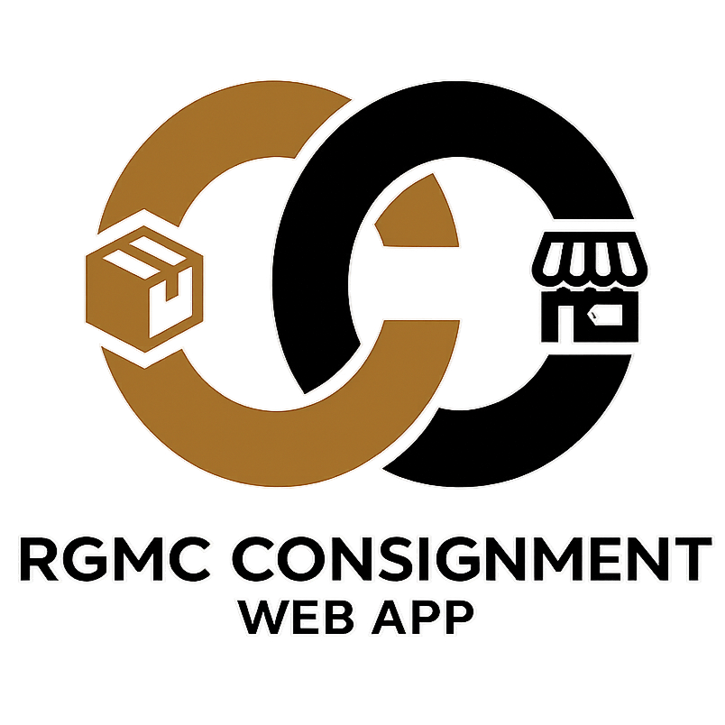
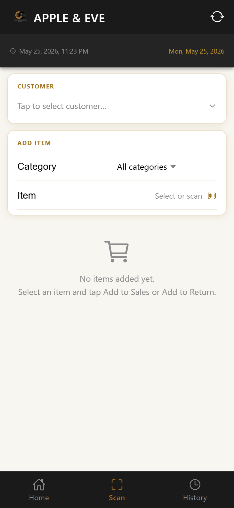

<div align="center">



# <span style="color:#A07320">RGMC Consignment</span>

### <span style="color:#666">A mobile-first Progressive Web App for managing consignment sales & return orders</span>

[](https://vuejs.org/)
[](https://ionicframework.com/)
[](https://www.typescriptlang.org/)
[](https://capacitorjs.com/)

</div>

---

## <span style="color:#A07320">📋 Table of Contents</span>

1. [Overview](#-overview)
2. [Tech Stack](#-tech-stack)
3. [Features](#-features)
4. [Screens](#-screens)
5. [Screenshots](#-screenshots)
6. [Project Structure](#-project-structure)
7. [Setup & Installation](#-setup--installation)
8. [Environment Variables](#-environment-variables)
9. [Running the App](#-running-the-app)
10. [Building for Production](#-building-for-production)
11. [Mobile Deployment (Capacitor)](#-mobile-deployment-capacitor)
12. [API Endpoints](#-api-endpoints)
13. [Data & Caching Strategy](#-data--caching-strategy)
14. [Authentication Flow](#-authentication-flow)
15. [Session Lifecycle](#-session-lifecycle)
16. [Barcode Scanner](#-barcode-scanner)

---

## <span style="color:#A07320">🧭 Overview</span>

**RGMC Consignment** is a mobile-first PWA designed for RGMC field sales agents. It lets agents scan or manually select items, attach them to a customer account, and consolidate them into **Sales Orders** or **Return Orders** — all submitted directly to the GCP backend API.

The app is fully **offline-capable** for data entry: all master data (customers, items, categories) is cached in `localStorage` after the first sync. Agents can build entire sessions without an internet connection and submit when connectivity is restored.

> 💡 Designed for use on Android mobile devices held by sales agents during store visits, but also works on any modern desktop or tablet browser.

---

## <span style="color:#A07320">🛠️ Tech Stack</span>

| Layer | Technology | Version |
|---|---|---|
| 🖼️ UI Framework | [Ionic Vue](https://ionicframework.com/docs/vue/overview) | 8.3 |
| ⚙️ Frontend Framework | [Vue 3](https://vuejs.org/) (Composition API) | 3.4 |
| 🔷 Language | TypeScript | 5.4 |
| 🗃️ State Management | [Pinia](https://pinia.vuejs.org/) | 2.1 |
| 🌐 HTTP Client | [Axios](https://axios-http.com/) | 1.7 |
| 🔀 Router | Vue Router + `@ionic/vue-router` | 4.3 |
| 📦 Build Tool | [Vite](https://vitejs.dev/) | 5.2 |
| 📱 Native Wrapper | [Capacitor](https://capacitorjs.com/) | 6.1 |
| 💾 Persistence | Browser `localStorage` | — |
| 🔍 Barcode Detection | [BarcodeDetector API](https://developer.mozilla.org/en-US/docs/Web/API/BarcodeDetector) | Native |

---

## <span style="color:#A07320">✨ Features</span>

### <span style="color:#2a9d8f">🔐 Authentication</span>
- Brand-scoped login — agent selects their assigned brand from a dropdown, then authenticates using their **Display Name** and **Phone Number** (matched against the Contacts API)
- Session is persisted to `localStorage` — agents stay logged in across page refreshes
- Full logout with confirmation alert that clears session and redirects to splash

### <span style="color:#2a9d8f">🌀 Splash Screen & Pre-loading</span>
- Sequential pre-load of **Brands** then **Contacts** with animated step indicators
- Gold progress bar and animated ring pulse during loading
- Retry button if any endpoint fails
- After successful load, auto-redirects to Home (if authenticated) or Login

### <span style="color:#2a9d8f">🏠 Landing / Home</span>
- Lists all pending **draft sessions** with resume and delete actions
- Shows a brand-filtered customer preview (first 8 customers for the logged-in brand)
- "Start New Session" button creates a fresh draft tied to the current brand and user
- Logout button with confirmation

### <span style="color:#2a9d8f">📸 Scanning / Order Entry</span>
- **Customer selection modal** — searchable, filtered to the agent's brand using keyword mapping
- **Item category selector** — dropdown to narrow item scope
- **Item selector modal** — searchable list with category chips, shows item code, name, description, and unit price; limited to 100 results at a time
- **Barcode scanner** — uses the native `BarcodeDetector` API (Chrome/Android); animated scan frame overlay with sweeping scan line; resolves scanned code to item by exact/partial number match
- **Manual barcode input** — fallback text field inside the scanner view
- **Auto-fill** — selecting an item fills in Description and SRP automatically
- **Discount input** — supports both `%` (percentage off) and `₱` (fixed amount off), with live computed total
- **Dual order lists** — tabbed Sales / Returns lists with per-line swipe-to-delete (Ionic sliding items)
- **Running subtotals** — live totals update as lines are added or removed
- **Sticky submit bar** — always-visible "Review & Submit" button with the current line count badge

### <span style="color:#2a9d8f">📤 Submit Screen</span>
- Full session summary: customer card, separate Sales and Returns order line tables
- **Independent submission** — Sales and Returns are submitted as separate POST requests; each shows its own status (Pending → Submitting → Done / Failed)
- **Series number display** — on success, the SO# or SRO# returned by the API is shown prominently
- **Retry on failure** — individual retry buttons per order type if a submission fails
- **Finalize Session** — saves the session to history (with submitted series numbers or error message) and navigates to History

### <span style="color:#2a9d8f">📜 History Screen</span>
- **Filter chips** — filter sessions by All / Submitted / Failed, each showing a live count
- **Rich session rows** — shows customer name, brand, date, line counts, subtotals, series numbers, and a truncated error preview for failed sessions
- **Detail modal** — tap any session row to open a full-screen detail view showing:
  - Session metadata (customer, brand, user, date, submitted time)
  - Series numbers (SO# / SRO#)
  - Error message for failed sessions
  - Full line-item tables for Sales and Returns
  - Subtotals and a grand total bar
- **Retry failed sessions** — "Retry Submission" button in the detail modal restores the session as a draft and navigates to the Submit screen
- **Export .txt** — download button exports the current filtered sessions (or a single session) as a formatted plain-text file with all line items, subtotals, and grand totals

### <span style="color:#2a9d8f">📴 Offline Support</span>
- All master data (customers, items, item categories) cached after first sync
- Stale-check: cache is considered fresh for **1 hour**; manual sync available anytime via the Scanning page sync bar
- Sessions and drafts persist entirely in `localStorage` — no network needed for order entry
- Only the final POST (submit) requires internet

---

## <span style="color:#A07320">🖥️ Screens</span>

```
/splash         →  Pre-load splash (brands + contacts)
/login          →  Brand selection + credential login
/app/home       →  Landing: drafts, customer preview, new session
/app/scan       →  Order entry: customer, items, barcode, line lists
/app/history    →  Session history: filter, detail, retry, export
/app/submit     →  Review & submit sales/return orders
```

> 🔒 All `/app/*` routes are protected by an auth guard. Unauthenticated users are redirected to `/splash` so master data is always pre-loaded before login.

---

## <span style="color:#A07320">📸 Screenshots</span>

### <span style="color:#2a9d8f">📱 Mobile (390 × 844)</span>

<table>
  <tr>
    <td align="center"><b>Splash</b></td>
    <td align="center"><b>Login</b></td>
    <td align="center"><b>Home / Landing</b></td>
  </tr>
  <tr>
    <td></td>
    <td></td>
    <td></td>
  </tr>
  <tr>
    <td align="center"><sub>Sequential data loading — brands then contacts, animated gold progress bar</sub></td>
    <td align="center"><sub>Brand dropdown + display name + phone number auth</sub></td>
    <td align="center"><sub>Welcome strip, pending drafts, Start New Session CTA, tab bar</sub></td>
  </tr>
</table>

<table>
  <tr>
    <td align="center"><b>Scanning — Order Form</b></td>
    <td align="center"><b>Scanning — Order Lines</b></td>
    <td align="center"><b>Submit / Review</b></td>
  </tr>
  <tr>
    <td></td>
    <td></td>
    <td></td>
  </tr>
  <tr>
    <td align="center"><sub>Customer picker, category selector, item + barcode trigger, discount fields</sub></td>
    <td align="center"><sub>Tabbed Sales / Returns lists with swipe-to-delete, running subtotals</sub></td>
    <td align="center"><sub>Session summary, independent Sales + Returns submit buttons</sub></td>
  </tr>
</table>

<table>
  <tr>
    <td align="center"><b>History — Session List</b></td>
    <td align="center"><b>History — Detail Modal</b></td>
  </tr>
  <tr>
    <td></td>
    <td></td>
  </tr>
  <tr>
    <td align="center"><sub>Filter chips (All · Submitted · Failed), series numbers in gold, error preview in red</sub></td>
    <td align="center"><sub>Full-screen detail: line items, series number, grand total, Retry button</sub></td>
  </tr>
</table>

---

### <span style="color:#2a9d8f">🖥️ Desktop (1280 × 800)</span>

**Landing**


**Scanning**


**History**


---

## <span style="color:#A07320">📁 Project Structure</span>

```
rgmc-consignment-webapp/
├── public/
│   └── static/
│       └── cons-logo.png          # App logo (used in headers & splash)
├── src/
│   ├── components/
│   │   ├── AppLogo.vue            # Reusable logo component
│   │   └── ItemSelectorModal.vue  # Item search + barcode scanner modal
│   ├── composables/
│   │   ├── useSync.ts             # Master data sync logic (customers, items, categories)
│   │   └── useCustomerFilter.ts   # Brand-to-keyword customer filtering
│   ├── router/
│   │   └── index.ts               # Routes + structure
│   ├── services/
│   │   ├── api.service.ts         # Axios HTTP client + all 7 API endpoints
│   │   └── storage.service.ts     # localStorage wrapper (read/write/remove per key)
│   ├── stores/
│   │   ├── auth.store.ts          # Pinia: login, logout, session persistence
│   │   └── session.store.ts       # Pinia: order lines, drafts, submit lifecycle
│   ├── theme/
│   │   └── variables.css          # RGMC brand theme (gold #A07320, dark header)
│   ├── types/
│   │   └── index.ts               # All shared TypeScript interfaces
│   ├── utils/
│   │   └── format.ts              # formatCurrency, formatDate, formatDiscount
│   └── views/
│       ├── SplashPage.vue         # Pre-load screen
│       ├── LoginPage.vue          # Brand + credential login
│       ├── TabsPage.vue           # Tab bar shell (Home / Scan / History)
│       ├── LandingPage.vue        # Home tab
│       ├── ScanningPage.vue       # Scan tab (order entry)
│       ├── SubmitPage.vue         # Submit screen
│       └── HistoryPage.vue        # History tab
├── .env                           # Dev: empty VITE_API_BASE_URL (uses Vite proxy)
├── .env.production                # Prod: full GCP API base URL
├── capacitor.config.ts            # Capacitor app config
├── vite.config.ts                 # Vite config + CORS proxy
├── tsconfig.json
└── package.json
```

---

## <span style="color:#A07320">⚙️ Setup & Installation</span>

### Prerequisites

- **Node.js** ≥ 18
- **npm** ≥ 9

### Clone & Install

```bash
git clone <your-repo-url>
cd rgmc-consignment-webapp
npm install
```

> ⚠️ No additional global tools required. Vite, TypeScript, and vue-tsc are all installed as local dev dependencies.

---

## <span style="color:#A07320">🔧 Environment Variables</span>

The app uses two env files:

| File | Used When | `VITE_API_BASE_URL` value |
|---|---|---|
| `.env` | Local development (`npm run dev`) | *(empty string)* — routes through Vite proxy |
| `.env.production` | Production build (`npm run build`) | `https://rgmc-gcp-api-935246372408.asia-southeast1.run.app` |

### `.env`
```env
VITE_API_BASE_URL=
```

### `.env.production`
```env
VITE_API_BASE_URL=https://rgmc-gcp-api-935246372408.asia-southeast1.run.app
```

> 💡 The Vite proxy in `vite.config.ts` forwards all `/bc/*` requests to the GCP API during development, bypassing CORS. In production, requests go directly to the full URL.

---

## <span style="color:#A07320">🚀 Running the App</span>

### Development Server

```bash
npm run dev
```

Opens at **[http://localhost:8100](http://localhost:8100)**

The dev server includes:
- Hot Module Replacement (HMR)
- Vite proxy for CORS bypass (all `/bc/*` → GCP API)
- TypeScript type-checking via vue-tsc

### Type Check Only

```bash
npx vue-tsc --noEmit
```

---

## <span style="color:#A07320">📦 Building for Production</span>

```bash
npm run build
```

This runs `vue-tsc` (type-check) followed by `vite build`. Output goes to `dist/`.

```bash
npm run preview
```

Serves the production build locally for testing before deployment.

### Deploy

Upload the contents of `dist/` to any static hosting provider (Firebase Hosting, GCP Cloud Storage + CDN, Netlify, Vercel, etc.).

---

## <span style="color:#A07320">📱 Mobile Deployment (Capacitor)</span>

The app is configured for [Capacitor](https://capacitorjs.com/) with App ID `com.rgmc.consignment`.

```bash
# 1. Build the web assets first
npm run build

# 2. Sync to native project
npx cap sync android

# 3. Open in Android Studio
npx cap open android
```

> 📌 The `BarcodeDetector` API is available natively on Android Chrome and on Chromium-based desktop browsers. On iOS or Firefox, the manual barcode input fallback is used automatically.

---

## <span style="color:#A07320">🌐 API Endpoints</span>

All requests are prefixed with `/bc` (proxied in dev, full URL in production).

| Method | Endpoint | Description |
|---|---|---|
| `GET` | `/bc/brands` | List all brands (used on splash + login) |
| `GET` | `/bc/contacts` | List all contacts (used for authentication) |
| `GET` | `/bc/customers` | List all customers (cached after first sync) |
| `GET` | `/bc/items` | List all items (slim fields cached — see below) |
| `GET` | `/bc/item-categories` | List all item categories |
| `POST` | `/bc/sales-orders` | Submit a sales order batch |
| `POST` | `/bc/sales-return-orders` | Submit a sales return order batch |

### <span style="color:#555">POST Payload: Sales Order</span>

```json
{
  "customerNumber": "C00123",
  "lines": [
    {
      "itemNumber": "ITEM-001",
      "description": "Item description",
      "quantity": 3,
      "unitPrice": 250.00,
      "discountPercent": 10
    }
  ]
}
```

> Discount is sent as `discountPercent` for percentage discounts, or `lineDiscountAmount` for fixed-amount discounts.

---

## <span style="color:#A07320">💾 Data & Caching Strategy</span>

All master data is stored in `localStorage` under namespaced keys:

| Key | Contents | Notes |
|---|---|---|
| `rgmc_auth` | Current auth session (brand + user) | Cleared on logout |
| `rgmc_cache_brands` | Brand list | Pre-loaded on splash |
| `rgmc_cache_contacts` | Contact list | Pre-loaded on splash |
| `rgmc_cache_customers` | Customer list | Synced on first scan session |
| `rgmc_cache_items` | **Slim** item list | Only essential fields stored (see below) |
| `rgmc_cache_item_categories` | Item category list | Synced with items |
| `rgmc_sync_timestamps` | Last sync time per entity | Stale threshold: 1 hour |
| `rgmc_sessions` | Completed session history | Submitted + failed |
| `rgmc_drafts` | In-progress draft sessions | Auto-saved on every change |

### <span style="color:#555">🗜️ Slim Item Storage</span>

The items endpoint returns >10MB of data. To avoid localStorage quota limits, only these fields are persisted per item:

```
id, number, displayName, description, type,
itemCategoryId, itemCategoryCode, baseUnitOfMeasure,
unitPrice, lastModifiedDateTime
```

### <span style="color:#555">🔄 Sync Logic</span>

- Customers, Items, and Item Categories are fetched **in parallel** via `Promise.all`
- Cache is considered **stale after 1 hour** — `useSync.syncIfStale()` checks this on Scanning page mount
- A manual **"Sync Now"** button is always available in the Scanning page header bar
- The sync bar shows last sync time and a loading spinner during refresh

---

## <span style="color:#A07320">🔐 Authentication Flow</span>

```
1. Splash screen pre-loads Brands + Contacts → cached to localStorage
2. Agent selects Brand from dropdown
3. Agent enters Display Name (username) and Phone Number (password)
4. Auth store matches against cached Contacts:
     displayName.toUpperCase() === username.toUpperCase()
     contact.phoneNumber === password
5. On match → AuthSession { brand, user } saved to localStorage
6. Route guard redirects to /app/home
7. On any subsequent visit, auth is rehydrated from localStorage automatically
```

> 🛡️ There is no token-based auth — the API itself handles server-side authorization. The local auth merely controls app navigation and session scoping.

---

## <span style="color:#A07320">📋 Session Lifecycle</span>

```
startNewSession()
      │
      ▼
   [ draft ] ──── auto-saved to localStorage on every change
      │
      ├─── resumeDraft()      ← resume from Landing page
      ├─── deleteDraft()      ← delete from Landing page
      │
      ▼
   Submit Page
      │
      ├─── markSubmitted()    → status: 'submitted', removed from drafts, saved to history
      ├─── markFailed()       → status: 'failed', saved to history (session remains for retry)
      │
      └─── retryFailedSession() ← from History detail modal
                │
                ▼
            [ draft ]  ← restored, re-saved as draft, navigate to Submit
```

### <span style="color:#555">Order Line Math</span>

```ts
// Percentage discount
total = srp * quantity * (1 - discountValue / 100)

// Fixed amount discount
total = Math.max(0, srp * quantity - discountValue)
```

---

## <span style="color:#A07320">📷 Barcode Scanner</span>

The scanner is integrated directly into the **Item Selector Modal** as a toggle view (List ↔ Scanner).

### How it works

1. Agent taps the barcode icon in the Item Selector Modal header
2. `getUserMedia({ facingMode: 'environment' })` opens the rear camera
3. `BarcodeDetector` polls the video feed **every 250ms** for supported formats:
   - `ean_13`, `ean_8`, `code_128`, `code_39`, `upc_a`, `upc_e`, `qr_code`
4. On detection → `resolveBarcode(code)` is called:
   - **Exact match**: `item.number === scanned code` → item selected immediately
   - **Partial match**: `item.number` contains or is contained by the scanned code → selected
   - **No match**: switches back to list view, pre-fills search query with the scanned code, shows a "not found" banner
5. Camera is stopped and stream tracks released on modal close or unmount

### Fallback

If `BarcodeDetector` is not available (iOS Safari, Firefox), the camera still opens but auto-detection is skipped. The **manual input field** at the bottom of the scanner view is always available as a fallback.

---

## <span style="color:#A07320">🎨 Brand Theme</span>

| Token | Value | Usage |
|---|---|---|
| `--app-gold` | `#A07320` | Primary color, buttons, active states |
| `--app-gold-pale` | `#F0E6CC` | Subtotal backgrounds, highlights |
| `--app-header-bg` | `#1A1A1A` | Header and tab bar background |
| `--app-dark` | `#1A1A1A` | Dark text, grand total bar |
| `--app-surface` | `#FFFFFF` | Card and list backgrounds |
| `--app-bg` | `#F4F4F4` | Page background |
| `--app-border` | `#E0E0E0` | Dividers and card borders |
| `--app-text-muted` | `#888888` | Secondary labels, hints |

---

## <span style="color:#A07320">📄 License</span>

Private — internal use by RGMC field sales agents only.

---

<div align="center">
<sub>Built with ❤️ using Ionic + Vue 3 + TypeScript</sub>
</div>
